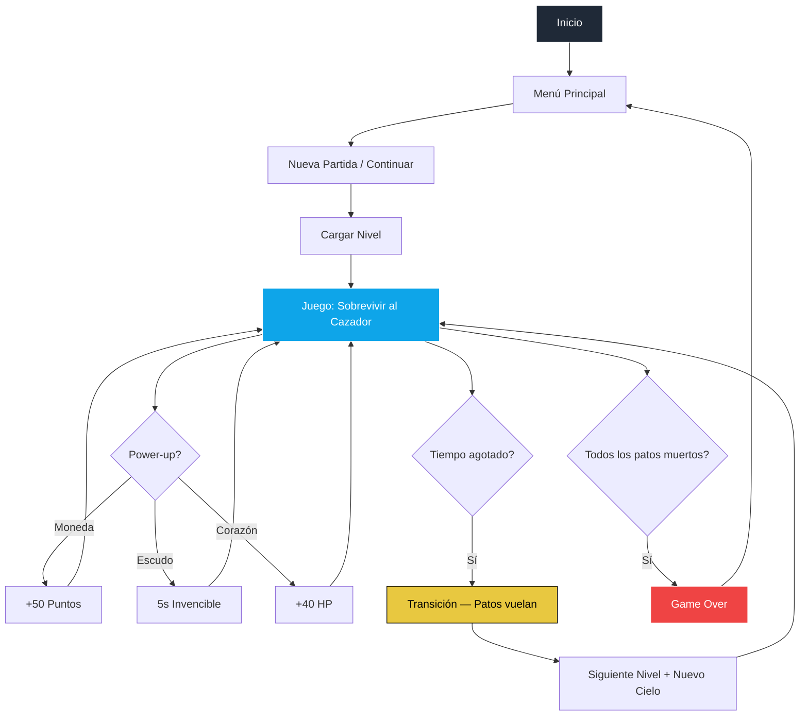

# 🦆 The Feather Exodus


---

## Vista previa

<div align="center">

### Menú Principal


### Gameplay


</div>

---

## Web en vivo

<div align="center">
  <a href="https://jhormancastella.github.io/the-feather-exodus/" target="_blank">
    
  </a>
</div>

---

## Descripción

**The Feather Exodus** es un juego de acción y supervivencia inspirado en Duck Hunt (Nintendo, 1984), desarrollado completamente en JavaScript puro sin frameworks. Controlas un pato que debe sobrevivir a los disparos de un cazador mientras avanzas por niveles con cielos cambiantes — desde el amanecer hasta una tormenta eléctrica. Recoge power-ups, usa el boost para esquivar y lleva a tu bandada a la siguiente zona.

---

## Capturas del juego

<div align="center">

| Menú NES | Gameplay Amanecer |
|:---:|:---:|
| Menú principal estilo NES con título bilingüe | Patos volando con cielo de atardecer |

</div>

---

## Características principales

- **Menú estilo NES** con título animado bilingüe (ES/EN) y navegación por teclado
- **4 ciclos de cielo dinámicos**: Amanecer → Mediodía → Atardecer → Tormenta con lluvia y relámpagos
- **IA del cazador** con mira animada, recarga y fases de disparo
- **Sistema de boost** con invencibilidad temporal al pato controlado
- **Power-ups flotantes**: 🪙 Moneda (+50 pts), 🛡️ Escudo (5s invencible), ❤️ Corazón (+40 HP)
- **Galería desbloqueable** con imágenes reales por nivel alcanzado
- **Créditos animados** con patos volando, cayendo e impactados en el fondo
- **Menú de pausa** con estadísticas en tiempo real y navegación por teclado
- **Música de fondo** en el menú con fade out al iniciar partida
- **Efectos de sonido**: disparo, caída de pato, perro, cambio de nivel, derrota
- **Multilenguaje**: Español e Inglés — cambiable desde Opciones
- **Guardado automático** en localStorage (progreso, puntuación, configuración)
- **Soporte móvil** con joystick virtual táctil y botón de pausa

---

## Vista rápida

| Característica | Estado |
|---|---|
| Menú Principal NES | ✅ |
| Título bilingüe animado | ✅ |
| 4 Ciclos de cielo | ✅ |
| Tormenta con lluvia y relámpagos | ✅ |
| IA del cazador | ✅ |
| Sistema de boost + escudo | ✅ |
| Power-ups (moneda, escudo, corazón) | ✅ |
| Galería desbloqueable | ✅ |
| Créditos con patos animados | ✅ |
| Menú de pausa con stats | ✅ |
| Música de menú con fade | ✅ |
| Efectos de sonido | ✅ |
| Idioma ES / EN | ✅ |
| Controles táctiles | ✅ |
| Guardado en LocalStorage | ✅ |

---

## Flujo general del juego



---

## Tecnologías utilizadas

- **HTML5** — Estructura y layout
- **CSS3** — Estilos, animaciones, ciclos de cielo, efectos de tormenta
- **JavaScript ES6+** — Motor del juego, IA, física, audio, i18n
- **Web Audio API** — Reproducción de sonidos y música
- **Cloudinary** — Alojamiento de assets (sprites, imágenes de galería, audio)
- **LocalStorage** — Persistencia de progreso, puntuación y configuración

---

## Estructura del proyecto

```
index.html
css/
  global.css       — reset, layout
  background.css   — 4 ciclos de cielo + tormenta
  menu.css         — menú NES
  hud.css          — HUD, controles móviles, pantallas
  game.css         — patos, power-ups, efectos
  modal.css        — galería, opciones, créditos, pausa
js/
  config.js        — niveles, coordenadas de sprites
  state.js         — estado global
  i18n.js          — traducciones ES / EN
  storage.js       — localStorage save/load
  audio.js         — música de menú + efectos de sonido
  hud.js           — HUD y referencias DOM
  ducks.js         — física, animación, daño, muerte
  powerups.js      — monedas, escudos, corazones
  hunter.js        — IA del cazador
  loop.js          — game loop, intervalos
  controls.js      — teclado + joystick táctil
  skycycle.js      — ciclos de cielo + tormenta
  game.js          — flujo principal del juego
  menu.js          — menús, modales, créditos, pausa
img/
  pt.png           — favicon
```

---

## Instalación y ejecución local

1. Clona el repositorio:
```bash
git clone https://github.com/Jhormancastella/the-feather-exodus.git
```

2. Abre `index.html` en cualquier navegador moderno o usa **Live Server**.

> No requiere instalación de dependencias ni build tools.

---

## Controles

### Teclado (PC)

| Tecla | Acción |
|---|---|
| `W A S D` / Flechas | Mover el pato |
| `Espacio` | Boost (velocidad + escudo temporal) |
| `Tab` | Cambiar al siguiente pato |
| `P` / `Esc` | Pausar / Reanudar |

### Táctil (Móvil)

| Control | Acción |
|---|---|
| Joystick izquierdo | Mover el pato |
| Botón BOOST | Activar impulso |
| Botón CAMBIAR | Cambiar de pato |
| Botón `II` (HUD) | Pausar juego |

---

## Ciclos de cielo

| Niveles | Ciclo | Descripción |
|---|---|---|
| 1 – 2 | 🌅 Amanecer | Cielo morado-naranja, sol bajo, nubes rosadas |
| 3 – 4 | ☀️ Mediodía | Cielo azul claro, sol brillante |
| 5 – 6 | 🌇 Atardecer | Cielo naranja-rojo, sol grande |
| 7 + | ⛈️ Tormenta | Cielo oscuro, lluvia, relámpagos |

---

## Licencia

Proyecto de código abierto bajo la autoría de **Jhorman Jesus Castellanos Morales**.
Puedes usarlo, adaptarlo y mejorarlo libremente.

---

## Autor

**Jhorman Jesus Castellanos Morales**
[GitHub Profile](https://github.com/Jhormancastella)
